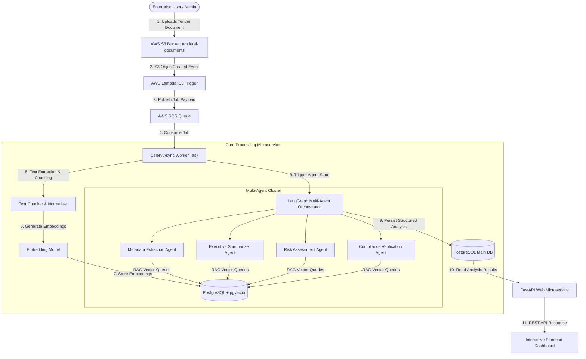
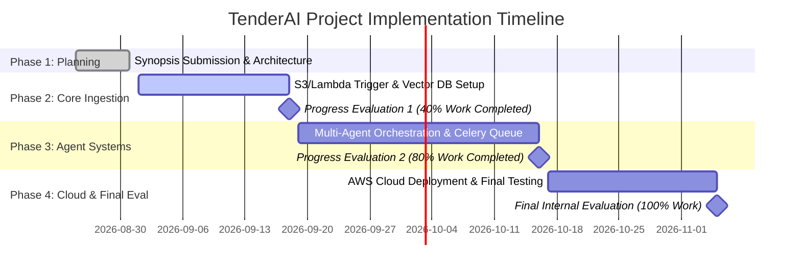

# PROJECT SYNOPSIS

**PROJECT TITLE:**  
# TenderAI: Enterprise Multi-Agent Tender Analysis, Risk Evaluation & Compliance System

**Degree:** Bachelor of Technology (B.Tech) in Artificial Intelligence & Data Science (AI & DS)  
**Academic Year:** 2026–2027 | Semester VII  
**Department:** Department of Computer Science & Engineering / Artificial Intelligence & Data Science  
**Institution:** Vivekananda Institute of Professional Studies - Technical Campus (VIPS-TC / VSE&T)  
**Affiliation:** Guru Gobind Singh Indraprastha University (GGSIPU), New Delhi  

---

## CANDIDATE DECLARATION & SUPERVISOR APPROVAL

### Candidate Declaration
We hereby declare that the project synopsis entitled **"TenderAI: Enterprise Multi-Agent Tender Analysis, Risk Evaluation & Compliance System"** is an authentic record of our own work carried out as a requirement for the award of the degree of **Bachelor of Technology in Artificial Intelligence & Data Science** at Vivekananda Institute of Professional Studies - Technical Campus (VIPS-TC). The matter embodied in this synopsis has not been submitted for the award of any other degree or diploma.

| Student Name | Roll Number | Department | Signature |
| :--- | :--- | :--- | :--- |
| Student 1 (Team Lead) | ____________________ | B.Tech (AI & DS) - 7th Sem | ____________________ |
| Student 2 | ____________________ | B.Tech (AI & DS) - 7th Sem | ____________________ |
| Student 3 | ____________________ | B.Tech (AI & DS) - 7th Sem | ____________________ |
| Student 4 | ____________________ | B.Tech (AI & DS) - 7th Sem | ____________________ |

---

### Supervisor Recommendation & Approval
The project synopsis entitled **"TenderAI: Enterprise Multi-Agent Tender Analysis, Risk Evaluation & Compliance System"** submitted by the above students of B.Tech (AI & DS) 7th Semester has been examined and approved for submission toward the Minor/Major Project evaluation.

**Project Supervisor:** __________________________________  
**Designation:** Assistant Professor / Associate Professor  
**Department:** Department of AI & DS / CSE, VIPS-TC  
**Signature & Date:** __________________________________  

---

\pagebreak

# ABSTRACT

In both public sector governance and private enterprise procurement, analyzing Requests for Proposals (RFPs) and tender document packages is a mission-critical yet severely bottlenecked operation. Tender packages routinely exceed hundreds of pages of complex legal mandates, technical specifications, financial eligibility criteria, penal clauses, and strict submission deadlines. Manual evaluation of these documents is labor-intensive, time-consuming, expensive, and susceptible to human oversight—frequently leading to missed submission deadlines, bid disqualification, or severe post-award contractual liabilities.

**TenderAI** addresses this industry-wide challenge by introducing a production-grade, enterprise-scale automated tender evaluation platform powered by **Multi-Agent Artificial Intelligence Systems**, **Retrieval-Augmented Generation (RAG)**, and **Cloud-Native Microservice Architectures**. Rather than relying on monolithic Large Language Model (LLM) calls with static prompt contexts, TenderAI deploys a cluster of specialized, domain-tailored AI agents (Metadata Extraction Agent, Executive Summarizer Agent, Legal/Financial Risk Assessment Agent, and Corporate Compliance Verification Agent) controlled by a central orchestrator operating on LangGraph/LangChain primitives.

The system utilizes **PostgreSQL with the `pgvector` extension** for high-dimensional vector similarity indexing, **Celery and Redis** for asynchronous job queue distribution, and **AWS (Lambda, S3, SQS, ECS Fargate, RDS)** provisioned declaratively via **Terraform Infrastructure-as-Code (IaC)**. The platform ingests multi-format tender packages, extracts structured semantic embeddings, performs contextual RAG searches, computes risk matrices and compliance gap scores against corporate profiles, and delivers interactive executive dashboards within minutes.

**Keywords:** Multi-Agent Systems, Large Language Models (LLM), Retrieval-Augmented Generation (RAG), `pgvector`, Vector Embeddings, Tender Analysis, Risk Evaluation, Automated Compliance, Infrastructure as Code (IaC), AWS Fargate, FastAPI.

---

\pagebreak

# TABLE OF CONTENTS

- **Certificate & Declaration**
- **Abstract**
- **1. Introduction & Background**
  - 1.1 Overview of Procurement & Tender Evaluation
  - 1.2 Motivation
  - 1.3 Problem Statement
  - 1.4 Project Objectives
  - 1.5 Scope & Deliverables
- **2. Literature Review & Comparative Analysis**
  - 2.1 Evolution of Document Information Extraction (Rule-Based to Deep Learning)
  - 2.2 Limitations of Monolithic LLMs in Complex Legal Analysis
  - 2.3 Emergence of Multi-Agent Systems (MAS) & RAG Frameworks
  - 2.4 Research Gaps Addressed by TenderAI
- **3. Requirement Specifications & Feasibility Analysis**
  - 3.1 Functional Requirements
  - 3.2 Non-Functional Requirements (Scalability, Security, Latency)
  - 3.3 System Feasibility (Technical, Operational, Economic)
  - 3.4 Software & Tools Specification
  - 3.5 Hardware Infrastructure Requirements
- **4. System Architecture & High-Level Design**
  - 4.1 System Overview & Data Flow
  - 4.2 Document Ingestion & Asynchronous Pipeline (Lambda + SQS + Celery)
  - 4.3 Vector Storage & Retrieval Subsystem (`pgvector`)
  - 4.4 Multi-Agent Framework & Orchestration Design
    - 4.4.1 Metadata Extraction Agent
    - 4.4.2 Executive Summarizer Agent
    - 4.4.3 Legal & Financial Risk Assessment Agent
    - 4.4.4 Compliance & Eligibility Verification Agent
  - 4.5 Database Schema & Entity-Relationship Model
- **5. Detailed Implementation Strategy & Algorithms**
  - 5.1 Document Chunking & Semantic Vectorization Algorithm
  - 5.2 Multi-Agent State Synchronization & Orchestration Logic
  - 5.3 RESTful API & Gateway Architecture (FastAPI)
  - 5.4 Infrastructure-as-Code (IaC) & AWS Provisioning via Terraform
- **6. Expected Deliverables, Research Outcomes & Evaluation Timeline**
  - 6.1 Expected Deliverables & Software Artifacts
  - 6.2 Proposed Research Paper / Patent Publication Plan
  - 6.3 Project Risk Analysis & Mitigation Strategies
  - 6.4 Project Timeline & Phase-wise Evaluation Milestones
- **7. Academic References & Bibliography**

---

\pagebreak

# CHAPTER 1: INTRODUCTION & BACKGROUND

## 1.1 Overview of Procurement & Tender Evaluation
Tendering represents the primary legal mechanism through which government entities, public sector undertakings (PSUs), and commercial enterprises procure goods, civil infrastructure, and specialized technical services. A typical tender submission process involves issuing detailed Request for Proposal (RFP) documentation, outlining contractual conditions, technical eligibility criteria, earnest money deposit (EMD) specifications, turnover thresholds, past project execution requirements, and penalty enforcement structures.

For bidding organizations, evaluating whether to participate in a given tender opportunity ("Bid/No-Bid Decision") requires a meticulous cross-functional audit involving legal counsel, financial analysts, domain engineers, and compliance officers.

## 1.2 Motivation
In fast-paced corporate environments, business development teams process dozens of complex tender documents concurrently. Traditional manual tender audits face severe structural bottlenecks:
1. **Volumetric Complexity:** A single procurement bundle may span 200 to 1,000+ pages of unstructured PDF text, scanned tables, technical annexures, and legal addenda.
2. **High Cost of Human Oversight:** Omitting a single buried clause (e.g., joint-venture restriction, stringent liquidated damages clause, or specific turnover calculation formula) can result in instant bid rejection or millions of dollars in post-contractual losses.
3. **Constrained Time Windows:** Organizations often have less than 7 to 14 days between RFP issuance and the submission deadline, creating immense operational pressure.

Leveraging modern Artificial Intelligence to automate semantic parsing, clause extraction, multi-perspective risk evaluation, and compliance verification offers a transformative opportunity for enterprise procurement efficiency.

## 1.3 Problem Statement
Existing commercial solutions for document processing are either **too simplistic** (basic keyword search or regex extraction) or **architecturally inadequate** (monolithic LLM prompts subject to token context limits, hallucination, and loss of fine-grained precision across large documents).

There is an urgent need for an **intelligent, end-to-end multi-agent software system** capable of:
* Extracting unstructured tender documents automatically upon upload.
* Parsing dense legal and technical clauses without losing contextual relationships.
* Evaluating multidimensional risks (financial, operational, legal) concurrently.
* Cross-referencing tender mandates directly against an enterprise's organizational profile.
* Operating in an asynchronous, fault-tolerant, cloud-native enterprise environment.

## 1.4 Project Objectives
The primary objective of **TenderAI** is to design, develop, and deploy an enterprise-grade automated tender analysis platform. The specific technical goals are:
1. **Automated Event-Driven Document Pipeline:** Build an S3-triggered event architecture with AWS Lambda, AWS SQS, and Celery workers for non-blocking asynchronous document ingestion.
2. **Semantic Vector Search Engine:** Integrate PostgreSQL with `pgvector` for efficient semantic indexing, hybrid keyword-vector search, and context retrieval.
3. **Multi-Agent Orchestration Architecture:** Implement specialized AI agents operating under a central LangGraph/LangChain orchestrator:
   - *Metadata Extraction Agent*
   - *Executive Summarizer Agent*
   - *Risk Assessment Agent*
   - *Compliance Verification Agent*
4. **Interactive Enterprise Dashboard & REST API:** Expose scalable OpenAPI-compliant endpoints via FastAPI and a modern dashboard displaying risk heatmaps and compliance matrices.
5. **Declarative Cloud Provisioning:** Automate entire cloud deployment (AWS ECS Fargate, RDS PostgreSQL, SQS, Lambda, IAM) using Terraform IaC.

## 1.5 Scope & Deliverables
The scope encompasses full-stack software development, cloud infrastructure automation, deep learning model integration, and academic research. Key deliverables include:
* Full source code repository for TenderAI backend microservices and async queue workers.
* Terraform infrastructure configuration files for reproducible AWS cloud deployment.
* Comprehensive API documentation and interactive web interface.
* Benchmark evaluation dataset measuring agent accuracy, recall, and processing speed.
* Research manuscript targeted for peer-reviewed IEEE/Springer conference publication.

---

\pagebreak

# CHAPTER 2: LITERATURE REVIEW & COMPARATIVE ANALYSIS

## 2.1 Evolution of Document Information Extraction
Early document processing relied heavily on Optical Character Recognition (OCR) coupled with Rule-Based Regex pattern matching. While effective for standardized invoices and tabular forms, rule-based systems fail when applied to unstructured, highly variable tender documents.

With the advent of Transformer architectures (Vaswani et al., 2017) and pre-trained language models (BERT, RoBERTa), Natural Language Processing shifted toward sequence labeling and Named Entity Recognition (NER). However, fine-tuned transformer models struggled with long-range dependencies across multi-page legal contracts.

## 2.2 Limitations of Monolithic Large Language Models
The emergence of Large Language Models (GPT-4, Claude 3, Llama 3) introduced zero-shot semantic understanding. However, applying a single monolithic LLM prompt to analyze an entire 300-page tender introduces critical vulnerabilities:
* **Context Window Degradation ("Lost in the Middle"):** Research by Liu et al. (2023) demonstrates that LLMs exhibit reduced recall performance when retrieving information located in the middle of long context windows.
* **Prompt Overloading & Cognitive Drift:** Expecting a single prompt to simultaneously check legal compliance, extract EMD dates, summarize scope, and score financial risk dilutes attention and increases hallucination rates.
* **High Token Cost & Latency:** Passing 300 pages of text in a single prompt call incurs massive computational overhead and prohibitive API costs.

## 2.3 Emergence of Multi-Agent Systems (MAS) & RAG
To overcome monolithic limitations, recent research favors **Retrieval-Augmented Generation (RAG)** combined with **Multi-Agent Systems (MAS)**. 

RAG decouples memory storage from model parameters by converting document chunks into dense vector embeddings stored in specialized databases (`pgvector`, Pinecone, FAISS) and retrieving top-k relevant context chunks at query time.

Multi-Agent Systems decompose complex workflows into specialized, autonomous sub-agents with dedicated prompts, tools, and domain roles. Studies (Wu et al., 2023; Li et al., 2024) confirm that multi-agent delegation significantly reduces hallucinations, improves precision, and enables parallel task execution.

## 2.4 Research Gaps Addressed by TenderAI
| Feature / Dimension | Keyword / Regex Search | Monolithic LLM Call | Standard RAG | **TenderAI (Proposed)** |
| :--- | :--- | :--- | :--- | :--- |
| **Long Document Support** | Limited | Token Limit Constrained | High | **High (Chunked Vector RAG)** |
| **Multi-Domain Risk Analysis** | No | Poor (Prompt Confusion) | Moderate | **High (Dedicated Risk Agent)** |
| **Compliance Cross-Matching** | No | Basic | Partial | **High (Matrix Verification Agent)** |
| **Asynchronous Infrastructure**| N/A | Synchronous / Slow | Partial | **Cloud-Native (Celery + SQS)** |
| **Reproducible Cloud IaC** | No | No | No | **Full (Terraform AWS Stack)** |

---

\pagebreak

# CHAPTER 3: REQUIREMENT SPECIFICATIONS & FEASIBILITY ANALYSIS

## 3.1 Functional Requirements
* **FR-1 (Document Upload & Ingestion):** The system must accept multi-page PDF, DOCX, and text procurement documents up to 250MB.
* **FR-2 (Asynchronous Queueing):** The system must immediately acknowledge uploads and queue processing jobs without blocking the web server thread.
* **FR-3 (Vector Indexing):** The system must parse text into 1,000-token chunks with 200-token overlaps and store 1536-dimensional embeddings in `pgvector`.
* **FR-4 (Metadata Extraction):** The system must extract Tender ID, Issuing Authority, EMD Amount, Pre-Bid Date, Submission Deadline, and Execution Period.
* **FR-5 (Executive Summarization):** The system must generate concise, non-technical executive summaries detailing the scope of work and key obligations.
* **FR-6 (Risk Assessment):** The system must identify legal penalties, strict timeline clauses, and financial indemnities, categorizing them into High, Medium, and Low risk tiers.
* **FR-7 (Compliance Verification):** The system must cross-evaluate required tender criteria against a uploaded Company Profile and generate a Pass/Gap checklist with direct text quotes.

## 3.2 Non-Functional Requirements
* **NFR-1 (Scalability):** The backend must handle horizontal scaling via containerized workers managed by AWS ECS Fargate autoscaling policies.
* **NFR-2 (Latency):** Total processing time for a 100-page document must not exceed 180 seconds.
* **NFR-3 (Data Security & Isolation):** All documents must be encrypted at rest in S3 using AES-256 and encrypted in transit via TLS 1.3.
* **NFR-4 (Auditability & Tracking):** All agent decisions, tool execution logs, and prompts must be recorded in PostgreSQL with timestamped execution traces.

## 3.3 System Feasibility Analysis
* **Technical Feasibility:** Highly feasible. The technical stack leverages robust, industry-standard open-source technologies (FastAPI, Python 3.11, PostgreSQL, Docker) paired with proven cloud infrastructure.
* **Operational Feasibility:** High. Procurement teams require minimal training; uploading a document produces actionable risk matrices and compliance reports automatically.
* **Economic Feasibility:** Excellent. Utilizing serverless AWS components (Lambda, SQS, auto-scaled Fargate tasks) ensures costs scale directly with usage, eliminating idle server expenses.

## 3.4 Software & Tool Specifications
* **Operating System:** Ubuntu 22.04 LTS / Amazon Linux 2023
* **Programming Language:** Python 3.11+
* **Web Framework:** FastAPI (Asynchronous Python REST API)
* **AI Frameworks:** LangChain, LangGraph, OpenAI API / Hugging Face Transformers
* **Database Engine:** PostgreSQL 15+ with `pgvector` extension
* **Task Queue & Broker:** Celery, Redis, AWS SQS
* **Cloud Infrastructure:** AWS (S3, ECS Fargate, Lambda, RDS PostgreSQL, IAM, CloudWatch)
* **Infrastructure as Code:** HashiCorp Terraform v1.6+
* **Containerization:** Docker Engine, Docker Compose

## 3.5 Hardware Infrastructure Requirements
* **Development Machine:** 16GB RAM, 8-Core CPU (Intel i7/Apple M-Series), 100GB NVMe SSD.
* **Production AWS Environment:**
  * *ECS Fargate Worker:* 1 vCPU, 2GB–4GB RAM per container task.
  * *RDS PostgreSQL Instance:* `db.t4g.medium` (2 vCPU, 4GB RAM, 100GB Storage).

---

\pagebreak

# CHAPTER 4: SYSTEM ARCHITECTURE & HIGH-LEVEL DESIGN

## 4.1 System Overview & Data Flow Diagram



## 4.2 Ingestion & Asynchronous Pipeline
To ensure high responsiveness:
1. When a user uploads a tender document, it is directly saved to an AWS S3 bucket.
2. An **AWS Lambda** function triggers instantaneously upon document arrival and enqueues an analysis request message containing document metadata into **AWS SQS**.
3. **Celery worker containers** running inside AWS ECS Fargate poll SQS asynchronously, execute the document processing workflow, and update job status indicators in real time.

## 4.3 Vector Storage Subsystem (`pgvector`)
Document text is split using a Recursive Character Text Splitter into 1,000-character chunks with a 200-character overlap. Each chunk is passed through an embedding model to generate 1536-dimensional dense vectors. 

These vectors are stored in PostgreSQL using the `pgvector` column type. Nearest-neighbor similarity search is performed using Cosine Distance (`<=>`), enabling lightning-fast RAG query retrieval.

## 4.4 Multi-Agent Framework Design
TenderAI employs four autonomous sub-agents operating under a unified **AgentState** object managed by LangGraph:

```
                  +-----------------------------------+
                  |   LangGraph Central Orchestrator  |
                  +-----------------------------------+
                                    |
         +------------------+-------+-------+------------------+
         |                  |               |                  |
         v                  v               v                  v
+-----------------+ +---------------+ +---------------+ +------------------+
|    Metadata     | |   Executive   | |Risk Evaluation| |   Compliance     |
| Extraction Agent| |Summarizer Agt.| |  Legal Agent  | | Verification Agt.|
+-----------------+ +---------------+ +---------------+ +------------------+
         |                  |               |                  |
         +------------------+-------+-------+------------------+
                                    |
                                    v
                  +-----------------------------------+
                  | PostgreSQL Structured Result Store|
                  +-----------------------------------+
```

### 4.4.1 Metadata Extraction Agent
* **Objective:** Isolates factual procurement parameters.
* **Extracted Fields:** Tender Reference Number, Issuing Organization, Earnest Money Deposit (EMD), Tender Fee, Pre-bid Conference Date, Submission Deadline, Contract Duration.

### 4.4.2 Executive Summarizer Agent
* **Objective:** Synthesizes large multi-page documents into strategic business insights.
* **Outputs:** Executive Summary, Scope of Work, Technical Requirements Overview, Key Project Objectives.

### 4.4.3 Risk Evaluation Agent
* **Objective:** Identifies legal penalties, financial exposure, and non-standard terms.
* **Risk Categories:** Liquidated Damages, Termination Clauses, Strict Delivery Timelines, Sole Liability Clauses, Sub-contracting Restrictions. Categorized into High, Medium, and Low risk tiers with justification.

### 4.4.4 Compliance Verification Agent
* **Objective:** Compares tender eligibility requirements directly against a pre-stored Company Profile.
* **Outputs:** Compliance Scorecard (Mandate vs. Company Value, Pass/Fail Status, Gap Explanation, Direct Evidence Excerpt).

## 4.5 Database Entity-Relationship (ER) Schema Design

```
+-------------------+       1:N       +----------------------+
|    Tenders        |----------------<|   DocumentChunks     |
+-------------------+                 +----------------------+
| id (UUID) [PK]    |                 | id (UUID) [PK]       |
| title (VARCHAR)   |                 | tender_id (UUID) [FK]|
| s3_url (VARCHAR)  |                 | chunk_index (INT)    |
| status (VARCHAR)  |                 | content (TEXT)       |
| created_at (TS)   |                 | embedding (VECTOR)   |
+-------------------+                 +----------------------+
          |                                      |
          | 1:1                                  | 1:N
          v                                      v
+-------------------+                 +----------------------+
| TenderAnalyses    |                 |   AgentExecutionLogs |
+-------------------+                 +----------------------+
| id (UUID) [PK]    |                 | id (UUID) [PK]       |
| tender_id (UUID)  |                 | tender_id (UUID) [FK]|
| summary (TEXT)    |                 | agent_name (VARCHAR) |
| metadata_json(JSON|                 | status (VARCHAR)     |
| risk_matrix(JSONB)|                 | execution_time_ms    |
| compliance (JSONB)|                 | prompt_tokens (INT)  |
+-------------------+                 +----------------------+
```

---

\pagebreak

# CHAPTER 5: DETAILED METHODOLOGY & IMPLEMENTATION

## 5.1 Document Ingestion & Chunking Algorithm

```python
# Conceptual Algorithm for Document Chunking & Vector Ingestion
def process_tender_document(tender_id: str, document_path: str):
    # Step 1: Extract text from PDF/DOCX
    raw_text = extract_text_from_file(document_path)
    
    # Step 2: Split text into semantic chunks
    splitter = RecursiveCharacterTextSplitter(
        chunk_size=1000,
        chunk_overlap=200,
        separators=["\n\n", "\n", " ", ""]
    )
    chunks = splitter.split_text(raw_text)
    
    # Step 3: Compute dense vector embeddings & save to pgvector
    db_session = get_db_session()
    for idx, chunk_text in enumerate(chunks):
        vector_embedding = embedding_model.embed_query(chunk_text)
        chunk_record = DocumentChunk(
            tender_id=tender_id,
            chunk_index=idx,
            content=chunk_text,
            embedding=vector_embedding
        )
        db_session.add(chunk_record)
    
    db_session.commit()
    return {"status": "SUCCESS", "total_chunks": len(chunks)}
```

## 5.2 Multi-Agent Orchestration Workflow Logic
The orchestrator executes agents sequentially or in parallel depending on dependency constraints. The **Metadata** and **Summarization** agents run in parallel, followed by **Risk Analysis**, and finally **Compliance Verification** (which consumes extracted metadata and company state).

```python
# Pseudocode for Multi-Agent Task Orchestration
class TenderAnalysisState(TypedDict):
    tender_id: str
    company_profile: dict
    metadata_results: dict
    summary_results: dict
    risk_results: dict
    compliance_results: dict

def run_multi_agent_pipeline(tender_id: str, company_profile: dict):
    state = TenderAnalysisState(
        tender_id=tender_id,
        company_profile=company_profile,
        metadata_results={},
        summary_results={},
        risk_results={},
        compliance_results={}
    )
    
    # Parallel Execution: Metadata & Summary Agents
    state["metadata_results"] = MetadataAgent.run(tender_id)
    state["summary_results"] = SummarizerAgent.run(tender_id)
    
    # Sequential Execution: Risk Agent
    state["risk_results"] = RiskAgent.run(tender_id)
    
    # Sequential Execution: Compliance Agent (Requires Company Profile)
    state["compliance_results"] = ComplianceAgent.run(
        tender_id=tender_id, 
        profile=company_profile
    )
    
    # Persist aggregated analysis record
    save_final_analysis_to_db(state)
    return state
```

## 5.3 RESTful API Endpoint Specifications
The backend provides OpenAPI-compliant endpoints served via FastAPI:
* `POST /api/v1/tenders/upload`: Accepts tender PDF uploads, initiates S3 pipeline, and returns `tender_id` and job status.
* `GET /api/v1/tenders/{tender_id}/status`: Polls real-time processing stage (Ingesting, Embedding, Agent Analysis, Completed).
* `GET /api/v1/tenders/{tender_id}/summary`: Returns executive summary, metadata JSON, and key scope parameters.
* `GET /api/v1/tenders/{tender_id}/risks`: Returns categorized risk matrix with clause excerpts and severity ratings.
* `GET /api/v1/tenders/{tender_id}/compliance`: Returns compliance checklist cross-referenced against company profile.

## 5.4 Cloud Provisioning Architecture (Terraform IaC)
Infrastructure is managed declaratively via Terraform files located in `infra/terraform/`:
* `main.tf`: Defines AWS Provider, ECS Fargate Cluster, Task Definitions, and Service definitions.
* `networking.tf`: Provisions Virtual Private Cloud (VPC), Public/Private Subnets, Internet Gateways, NAT Gateways, and Security Groups.
* `iam.tf`: Configures IAM Roles for ECS Execution, Lambda Triggers, and S3 Read/Write permissions.
* `outputs.tf`: Exports S3 Bucket names, ECS Service endpoints, and RDS Connection endpoints.

---

\pagebreak

# CHAPTER 6: EXPECTED DELIVERABLES & EVALUATION TIMELINE

## 6.1 Expected Deliverables & Software Artifacts
1. **Production-Ready Web Application & REST API:** Fully functional FastAPI platform.
2. **Multi-Agent Framework:** Modular LangGraph agent package for enterprise document processing.
3. **Terraform Deployment Scripts:** Automated scripts to spin up and tear down AWS resources cleanly.
4. **Comprehensive Evaluation Dataset:** Benchmark metrics evaluating extraction accuracy, processing speed, and cost efficiency.

## 6.2 Proposed Research Paper / Patent Plan
* **Target Conference:** IEEE International Conference on Artificial Intelligence & Data Engineering / Springer Lecture Notes in Computer Science (LNCS).
* **Proposed Title:** *"Scalable Multi-Agent Orchestration and Vector Retrieval for Enterprise Tender Risk Assessment and Automated Compliance"*
* **Expected Submission Date:** November 2026.

## 6.3 Risk Management & Mitigation Strategies
| Risk Identification | Severity | Mitigation Strategy |
| :--- | :--- | :--- |
| **LLM Context Overload / Rate Limits** | Medium | Implement chunking, local fallback models, and exponential backoff retry mechanisms. |
| **Parsing Complex Scanned PDFs** | Medium | Integrate PyMuPDF with OCR fallback (Tesseract) for scanned images. |
| **AWS Cloud Resource Over-Budget** | Low | Use AWS Free Tier / Serverless ECS Fargate tasks with strict CPU/Memory task caps. |
| **Vector DB Query Latency** | Low | Implement HNSW / IVFFlat vector indexing in PostgreSQL (`pgvector`). |

## 6.4 Project Timeline & Milestone Alignment (As per VIPS Notice)



---

\pagebreak

# CHAPTER 7: ACADEMIC REFERENCES & BIBLIOGRAPHY

1. Vaswani, A., Shazeer, N., Parmar, N., Uszkoreit, J., Jones, L., Gomez, A. N., Kaiser, Ł., & Polosukhin, I. (2017). Attention is all you need. *Advances in Neural Information Processing Systems (NeurIPS)*, 30, 5998–6008.
2. Lewis, P., Perez, E., Piktus, A., Petroni, F., Karpukhin, V., Goyal, N., Küttler, H., Lewis, M., Yih, W., Rocktäschel, T., Riedel, S., & Kiela, D. (2020). Retrieval-augmented generation for knowledge-intensive NLP tasks. *Advances in Neural Information Processing Systems (NeurIPS)*, 33, 9459–9474.
3. Wu, Q., Bansal, G., Zhang, J., Wu, Y., Li, B., Tan, C., & Wang, C. (2023). AutoGen: Enabling next-gen LLM applications via multi-agent conversation. *arXiv preprint arXiv:2308.08155*.
4. Liu, N. F., Lin, K., Hewitt, J., Paranjape, A., Bevilacqua, M., Petroni, F., & Liang, P. (2023). Lost in the middle: How language models use long contexts. *Transactions of the Association for Computational Linguistics (TACL)*, 12, 157–173.
5. LangChain & LangGraph Development Team. (2024). *Building Autonomous Multi-Agent Workflows with LangGraph*. Official Documentation, LangChain Inc.
6. PostgreSQL Global Development Group. (2024). *pgvector: Open-source Vector Similarity Search for PostgreSQL*. GitHub Repository & Official Documentation.
7. AWS Documentation Team. (2024). *Architecting Serverless & Containerized Microservices on AWS ECS Fargate and AWS Lambda*. Amazon Web Services Whitepapers.
8. HashiCorp. (2024). *Terraform Infrastructure as Code: Provisioning Cloud Resources Declaratively*. HashiCorp Technical Documentation.

---
