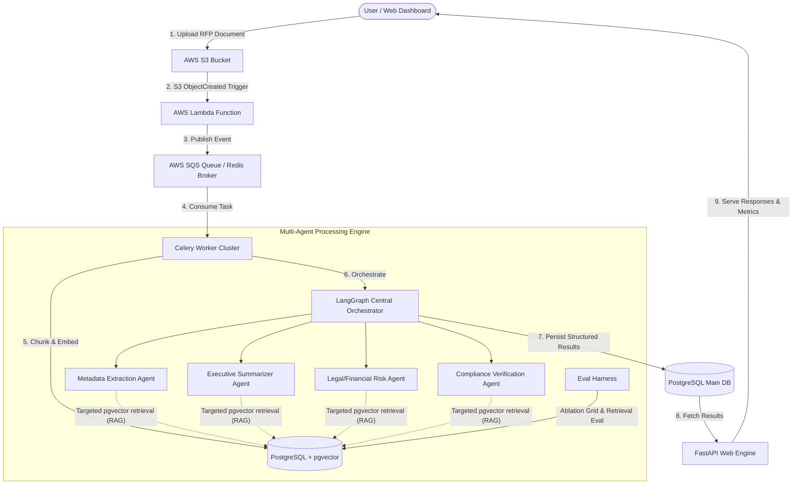

# TenderAI: Enterprise Multi-Agent Tender Analysis, Risk Evaluation & Compliance System

[](https://github.com/sharma614/Tender_AI/actions/workflows/ci.yml)
[](https://fastapi.tiangolo.com)
[](https://python.org)
[](https://docker.com)
[](https://terraform.io)

**TenderAI** is a production-grade, enterprise-scale automated tender evaluation platform powered by **Multi-Agent AI Systems**, **Retrieval-Augmented Generation (RAG)**, **Celery/Redis Asynchronous Queues**, and **AWS Cloud Microservices** provisioned via **Terraform Infrastructure-as-Code (IaC)**.

---

## 🏛️ System Architecture



---

## 🔑 Key Engineering & Architectural Decisions

### 1. Multi-Agent System vs. Monolithic LLM Call
* **Problem:** Monolithic LLM calls on 300+ page tenders suffer from context window degradation (*"Lost in the Middle"*), high hallucination rates, and token cost bloat.
* **Solution:** TenderAI breaks down evaluation into specialized, domain-tailored agents (**Metadata**, **Summarization**, **Risk Evaluation**, and **Compliance Verification**). Each agent operates with specialized prompt directives, targeted RAG context windows, and tool execution logs.

### 2. Retrieval-Augmented Generation (RAG) & Citation Verification
* Text is split into 1,000-character chunks with 200-character overlaps and converted into 384-dimensional dense vectors (`all-MiniLM-L6-v2`).
* Targeted queries hit PostgreSQL `pgvector` with Cosine Similarity Search (`<=>`), shrinking context window sizes by ~20× compared to full-document dumps.
* **Deterministic Grounding Verification:** `rag-cite` mode requests `chunk_id` and page citations for extracted fields and risk points. A zero-token substring containment check verifies whether cited claims actually appear in source chunks, tracking grounding precision and hallucination rates.

### 3. Monolithic Baseline & Scientific Ablation
* Includes `MonolithicAgent` as a single-prompt control arm.
* `eval_harness.py --mode ablation` runs a 4-way comparative grid (`mono-full`, `multi-full`, `multi-rag`, `multi-rag-cite`), measuring field accuracy, prompt tokens, estimated USD costs, latency, and grounding precision across configurations.

### 4. Asynchronous Job Processing (Celery + SQS/Redis)
* `POST /upload` acknowledges uploads instantly and returns `202 Accepted` with a `job_id`.
* Celery workers execute parsing, embedding, and multi-agent execution asynchronously.
* Built-in **Exponential Backoff Retry Schedule** (30s ➔ 120s ➔ 480s) and **Dead-Letter State Machine** for fault-tolerant operation.

---

## 🛠️ Tech Stack

* **Backend & API:** Python 3.11, FastAPI, Pydantic v2, SQLAlchemy
* **AI & RAG:** LangChain, LangGraph, `pgvector`, Hugging Face Transformers
* **Queue & Async:** Celery, Redis (Local Dev), AWS SQS (AWS Prod)
* **Cloud Infrastructure:** AWS (S3, ECS Fargate, Lambda, SQS, RDS PostgreSQL)
* **Infrastructure as Code:** HashiCorp Terraform

---

## 🚀 Quick Start (Local Development)

### 1. Clone & Set Up Environment
```bash
git clone https://github.com/your-username/TenderAI.git
cd TenderAI

# Create virtual environment
python -m venv venv
source venv/bin/activate  # On Windows: venv\Scripts\activate

# Install dependencies
pip install -r requirements.txt
```

### 2. Start PostgreSQL & Redis via Docker
```bash
docker-compose up -d
```

### 3. Start FastAPI Server
```bash
uvicorn app.main:app --reload --port 8000
```

### 4. Start Celery Worker
```bash
celery -A app.worker.celery_app worker --loglevel=info
```

---

## 📊 Observability & API Reference

### Core Endpoints
| Method | Endpoint | Description |
| :--- | :--- | :--- |
| `GET` | `/health` | Service health check |
| `POST` | `/upload` | Non-blocking tender PDF upload (returns `job_id`) |
| `GET` | `/jobs/{job_id}` | Poll job processing status & agent results |
| `GET` | `/tenders` | List all processed tenders |
| `GET` | `/admin/metrics` | System-wide agent latency, success rates, and token counts |

---

## 🧪 Testing & Evaluation Benchmark

### Running Unit & Integration Tests
```bash
python -m pytest tests/
```

### Running the Evaluation Harness

The harness has four modes. All reported numbers are computed from real runs — there are no hard-coded scores.

```bash
# Corpus integrity check (no DB or API key required — this is what CI runs)
python eval_harness.py --mode smoke

# Real vector-search retrieval quality (requires PostgreSQL + pgvector)
python eval_harness.py --mode retrieval --k 10

# End-to-end extraction accuracy (requires GEMINI_API_KEY)
python eval_harness.py --mode extraction --limit 5

# Full 4-way scientific ablation grid (mono-full vs multi-full vs multi-rag vs multi-rag-cite)
python eval_harness.py --mode ablation --limit 5
```

Results are written to `eval_results/<mode>-<timestamp>.json` so paper tables can be regenerated rather than retyped.

> **Corpus note:** The 18-document evaluation corpus is synthetic (generated by `corpus/generate_synthetic.py`) — a deliberate
> constraint documented in the [limitations](#-limitations) section. Retrieval numbers from a synthetic corpus are a lower bound.

---

## ☁️ AWS Cloud Infrastructure (Terraform)

Deploy to AWS ECS Fargate, S3, SQS, Lambda, and RDS PostgreSQL with a single script:

```bash
cd infra/terraform
terraform init
terraform plan
terraform apply -auto-approve
```

---

## ⚠️ Limitations

1. **Synthetic evaluation corpus.** The 18 evaluation documents are machine-generated (see `corpus/generate_synthetic.py`). Retrieval and extraction numbers therefore reflect performance on controlled synthetic text, not production government tenders.

2. **Deterministic grounding checks rely on exact/substring matching.** The citation verifier uses string containment and windowed matching to check whether cited facts exist in source chunks without spending extra LLM tokens. Paraphrased extractions that change numbers or terms significantly will be flagged as ungrounded even if semantically accurate.

---

## 📜 License
Licensed under the [MIT License](LICENSE).
